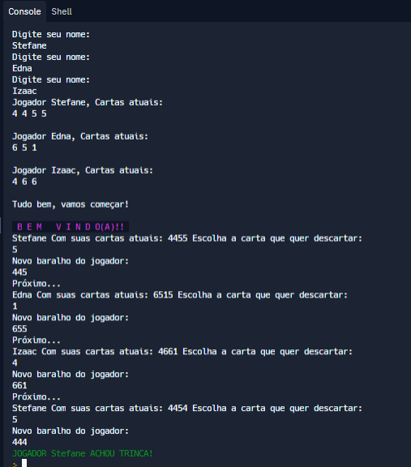

# JOGO DORMINHOCO. 

O objetivo desse repositório é apresentar uma versão beta do algoritmo para o jogo Dorminhoco. 

## Ordem de jogada:
Digite o nome de cada participante ordenadamente a cada leitura dos dados. Após isso, o jogo embaralha as cartas (No caso a versão beta tem três trincas de 4, 5 e 6 e uma carta com valor 1). 

Ao iniciar o jogo, o primeiro a iniciar a rodada será aquele que terá as quatro cartas na mão, e assim, escolherá uma carta para ser passado ao jogador adiante.

O jogo termina quando um dos participantes atingir uma trinca. 

### Teste da versão beta: 



## Pontos a serem melhorados:

-  Impressão das jogadas realizadas no scores.txt

## Comando de compilação e execução:

```
bash exe.sh
```